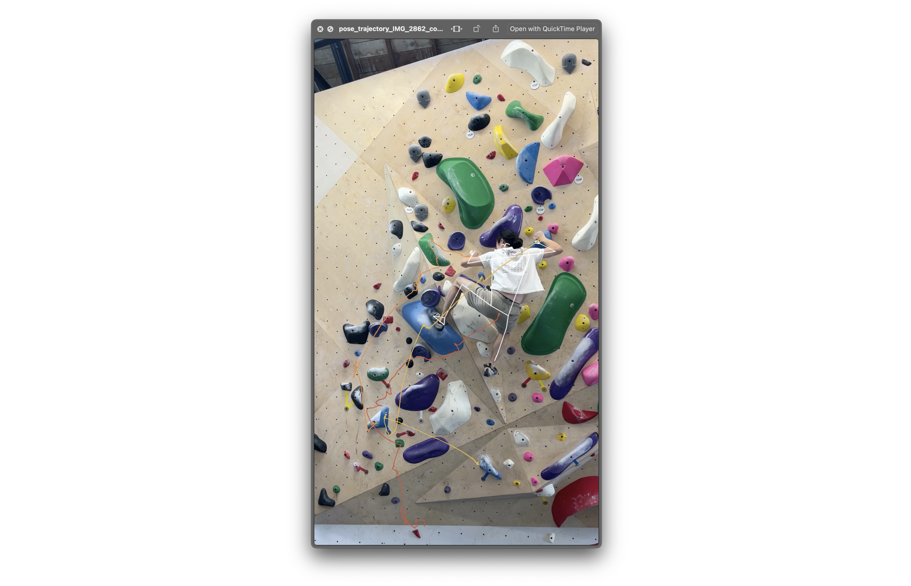

# Climbing Analysis Toolbox 

A set of computer vision tools for analyzing your climbing videos.

## Getting Started

```shell
# (Optional) Create an virtual env
python -m venv PATH_TO_YOUR_ENV
source PATH_TO_YOUR_ENV
```

```bash
# Install prerequisites
python -m pip install -r requirements.txt
```

## Catalogue

1. Warping Video for Scene Matching [goto](#warping-video-for-scene-matching)
2. Drawing Trajectories for Body Movements [goto](#drawing-trajectories-for-body-movements)

---

### Warping Video for Scene Matching

> To be edited.

### Drawing Trajectories for Body Movements

> It is recommended to apply this script to a video with fixed camera position, i.e., no one's holding the camera.



There is a couple of settings you can adjust inside the script for `extract_pose_and_draw_trajectory()`:

| Argument | Description | 
| - | - |
| `track_point`  | Points of interest on the estimated pose you want to track. A velocity vector arrow will be drawn to indicate how fast each point is moving with respect to its 3D position |
| `overlay_trajectory`  | Whether to overlay a half-transparent mask on top of the original video. Note that if this is set to `True`, the velocity vector arrow that corresponds to each track point will be removed. |
| `draw_pose`  | Whether to draw pose skeleton or not |
| `kalman_settings`  | Whether to apply Kalman filter to smooth out the trajectory (not the pose itself) |
| `trajectory_png_path`  | Whether to generate a `.png` file for the trajectory with black background |

Then, run the command as follows:

```shell
python tools/body_trajectory.py --video_path \
    "../videos/IMG_1915_converted.mp4"
```

The generated video will then be located inside of the `output` folder. An example generated video can be found [here](./examples/pose_trajectory_IMG_2862_converted.mp4)

Reference:

- ["How can I use smoothing techniques to remove jitter in pose estimation?"](https://stackoverflow.com/questions/52450681/how-can-i-use-smoothing-techniques-to-remove-jitter-in-pose-estimation)
- ["Savitzky–Golay filter"](https://en.wikipedia.org/wiki/Savitzky%E2%80%93Golay_filter)
- ["Kalman filter"](https://en.wikipedia.org/wiki/Kalman_filter)
- Papers
    - ["Temporal Smoothing for 3D Human Pose Estimation and Localization for Occluded People"](https://arxiv.org/abs/2011.00250)
    - ["SmoothNet: A Plug-and-Play Network for Refining Human Poses in Videos (ECCV 2022)"](https://ailingzeng.site/smoothnet)
    - ["Fast 3D Pose Estimation With Out-of-Sequence Measurements"](https://dellaert.github.io/files/Ranganathan07iros.pdf)
    - ["Towards Robust and Smooth 3D Multi-Person Pose Estimation from Monocular Videos in the Wild"](https://www.youtube.com/watch?v=yrQ3ZU4zB6Q), also see [[1]](https://openaccess.thecvf.com/content/ICCV2023/papers/Park_Towards_Robust_and_Smooth_3D_Multi-Person_Pose_Estimation_from_Monocular_ICCV_2023_paper.pdf)

## To-do

- [ ] Add a server backend to allow API request for specific functionality