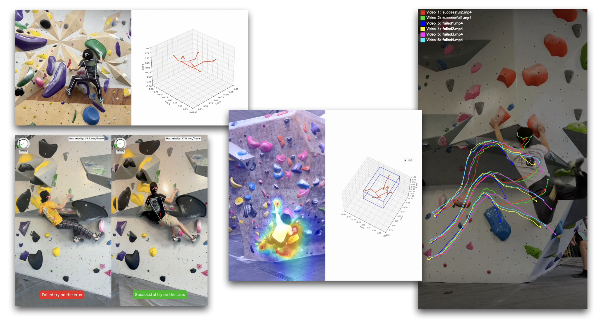

# Climbing Analysis Toolbox 

A set of computer vision tools for processing and analyzing your climbing videos.

[](https://opensource.org/licenses/MIT) [](https://www.python.org/downloads/release/python-3110/)



## Getting Started

```shell
# Create an virtual environment
python -m venv PATH_TO_YOUR_VENV
source PATH_TO_YOUR_VENV
```

### Prerequisites

```shell
# The following third-party dependency is needed for video warping (or scene matching)
python -m pip install git+https://github.com/alexstoken/image-matching-models.git
python -m pip install --upgrade cruxes # Install the latest version of this toolbox
```

Only proceed to the following content once you have installed the dependencies correctly.

## Catalogue

> For each section, there will be detailed example code for both CLI usage and in-code usage.

1. Warping Video for Scene Matching [Details](#1️⃣-warping-video-for-scene-matching)

```shell
# Example usage:
cruxes warp \
--ref_img "examples/videos/warp-dynamic-ref.jpg" \
--src_video_path "examples/videos/warp-dynamic-input.mp4"
# [--type ...]
```

2. Drawing Trajectories for Body Movements [[1]](https://www.instagram.com/stories/highlights/18047308238255136/) [Details](#2️⃣-drawing-trajectories-for-body-movements)

```shell
cruxes body-trajectory \
--video_path "examples/videos/body-trajectory-input.mp4"
# [other options]
```

### More to Come

- [ ] Heatmap for Limb Movement [[1]](https://www.instagram.com/stories/highlights/18047308238255136/)
- [ ] Climbing Hold Auto-segmentation
- [ ] Gaussian-splatting 3D Reconstructing a Climb

---

### 1️⃣ Warping Video for Scene Matching


Sometimes, to analyze our sequences for a climb, we typically have multiple sessions. During those sessions, we might have the camera placed at different locations, thus pointing from different angles towards the climb we are projecting. This tool helps you transform videos so that they match a reference image that corresponds to the whole picture of your climb. Reasons for doing this are: 

1. It is better for using tools that involve 2D/3D pose estimation
2. It is easier to see how your body moves with respect to similar angles. Note that, right now, it is impossible to seamlessly match a video to the scene of a base image if their camera angles and positions differ by a large amount; some area might be off from base scene.

To warp a video to match a reference scene, we extract the features between two frames, and then a homography matrix is extracted for the image transformation. By default, we use a per-frame homography matrix, but that also means we have to compute $H$ for each frame of the input video if the input video is moving. If the camera of your input video is not moving, we can reduce the processing time by only comparing the first frame of the video and the base scene. This reduces the computation time for the matcher we are using, so only image transformation is involved for the entire warping process. We call the first scenario `dynamic` and the second scenario `fixed`, as you can set with the `type` option.


```shell
# CLI usage
# Warp a video with moving camera (per-frame homography matrix for the transformation)
cruxes warp \
--ref_img "examples/videos/warp-dynamic-ref.jpg" \
--src_video_path "examples/videos/warp-dynamic-input.mp4"
# by default the type of warping is `dynamic`
```

```python
# In-code usage
from cruxes import Cruxes
cruxes = Cruxes()
cruxes.warp_video(
    "warp-dynamic-ref.jpg", 
    "warp-dynamic-input.mp4", 
)
```

<details>
    <summary> 🎬 Example Resulting Video </summary>
    <video width="480" controls>
        <source src="examples/videos/warp-dynamic-result.mp4" type="video/mp4">
        Your browser does not support the video tag.
    </video>
</details>

```shell
# CLI usage
# Warp a video with fixed camera (first-frame homography matrix for the transformation)
cruxes warp \
--ref_img "examples/videos/warp-fixed-ref.jpg" \
--src_video_path "examples/videos/warp-fixed-input.mp4" \
--type "fixed"
```

```python
# In-code usage
from cruxes import Cruxes
cruxes = Cruxes()
cruxes.warp_video(
    "warp-fixed-ref.jpg", 
    "warp-fixed-input.mp4", 
    warp_type="fixed"
)
```

<details>
    <summary> 🎬 Example Resulting Video </summary>
    <video width="480" controls>
        <source src="examples/videos/warp-fixed-result.mp4" type="video/mp4">
        Your browser does not support the video tag.
    </video>
</details>

> If you can't see the example resulting video, go to the [example/videos/](./examples/videos/) folder.

---

### 2️⃣ Drawing Trajectories for Body Movements

> It is recommended to apply this script to a video with fixed camera position, i.e., camera is not being moved.


There is a couple of settings you can adjust inside the script for `extract_pose_and_draw_trajectory()`:

| Argument | Description | 
| - | - |
| `track_point`  | Points of interest on the estimated pose you want to track. A velocity vector arrow will be drawn to indicate how fast each point is moving with respect to its 3D position |
| `overlay_trajectory`  | Whether to overlay a half-transparent mask on top of the original video. Note that if this is set to `True`, the velocity vector arrow that corresponds to each track point will be removed. |
| `draw_pose`  | Whether to draw pose skeleton or not |
| `kalman_settings`  | Whether to apply Kalman filter to smooth out the trajectory (not the pose itself) |
| `trajectory_png_path`  | Whether to generate a `.png` file for the trajectory with black background |

Then, run the command as follows:

```shell
# CLI usage
cruxes warp \
--video_path "examples/videos/body-trajectory-input.mp4"
```

```python
# In-code usage
from cruxes import Cruxes
cruxes = Cruxes()
cruxes.body_trajectory(
    "body-trajectory-input.mp4",
    track_point=[
        # Currently available points to track
        "hip_mid",
        "upper_body_center",
        "head",
        "left_hand",
        "right_hand",
        "left_foot",
        "right_foot",
    ],
    overlay_trajectory=False,
    draw_pose=True,
    kalman_settings=[  # Kalman filter settings: [use_kalman : bool, kalman_gain : float]
        True,  # Set this to false if you don't want to apply Kalman filter
        1e0,  # >=1e0 for higher noise, <=1e-1 for lower noise
    ],
    trajectory_png_path=None,
)
```

The generated video will then be located inside of the `output` folder.

<details>
    <summary> 🎬 Example Resulting Video </summary>
    <video width="480" controls>
        <source src="examples/videos/body-trajectory-result.mp4" type="video/mp4">
        Your browser does not support the video tag.
    </video>
   
</details>

> If you can't see the example resulting video, go to the [example/videos/](./examples/videos/) folder.

## To-do

- [ ] Add a server backend to allow API request for specific functionality.
- [x] Migrate to PyPI for easier installation and use.
- [x] Add CLI options to run (`cruxes` instead of `python ...`)