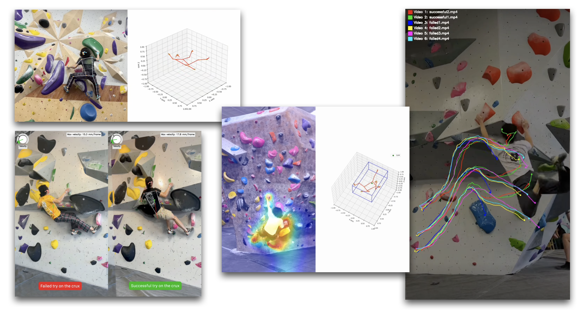

# Climbing Analysis Toolbox 

A set of computer vision tools for processing and analyzing your climbing videos. In my spare time, I also write about topics relevant to bouldering and computer vision [here](https://blog.tjtl.io/bouldering-and-computer-vision/).

[](https://opensource.org/licenses/MIT) [](https://www.python.org/downloads/release/python-3110/)



## Getting Started

```shell
# Create and activate a virtual environment
python -m venv .venv
source .venv/bin/activate

# Install or upgrade the published PyPI package
python -m pip install --upgrade pip
python -m pip install --upgrade cruxes

# Confirm the CLI is available
cruxes --help
```

The published package name is `cruxes`, and it installs the `cruxes` CLI.

PyPI: https://pypi.org/project/cruxes/

For image/video warping through the Python API, you can override the underlying matcher model with `Cruxes(matcher_model_name="...")` or `cruxes.set_matcher_model_name("...")`, and you can override the execution device with `Cruxes(matcher_device="...")` or `cruxes.set_matcher_device("...")`. By default, device selection is automatic and prefers `cuda`, then `mps`, then `cpu`. The full matcher catalog lives upstream in vismatch/imm and changes over time, so prefer the upstream docs for the current list rather than copying it into this README.

## Catalogue

> For each section, there will be detailed example code for both CLI usage and in-code usage.

1. **Warping Video for Scene Matching** [Details](#1️⃣-warping-video-for-scene-matching)

```shell
# Example usage:
cruxes warp \
--ref_img "examples/videos/warp-dynamic-ref.jpg" \
--src_video_path "examples/videos/warp-dynamic-input.mp4"
# [--type ...]

cruxes warp-image \
--ref_img "examples/videos/warp-dynamic-ref.jpg" \
--src_img_path "examples/videos/warp-image-input.jpg"
# [--output_img_path ...]
```

2. **Drawing Trajectories for Body Movements** [[1]](https://www.instagram.com/stories/highlights/18047308238255136/) [Details](#2️⃣-drawing-trajectories-for-body-movements)

```shell
cruxes body-trajectory \
--video_path "examples/videos/body-trajectory-input.mp4" \
--show_trajectory
# [other options]
```

3. **Compare Body Trajectories across Different Climbing Footages** [Details]()

### More to Come

- [ ] 3D Pose Extraction and Displaying
- [ ] Drawing Trajectories for Body Movements across Multiple Footages
- [ ] Heatmap for Limb Movement [[1]](https://www.instagram.com/stories/highlights/18047308238255136/)
- [ ] Climbing Hold Auto-segmentation
- [ ] Gaussian-splatting 3D Reconstructing a Climb

---

### 1️⃣ Warping Video for Scene Matching


Sometimes, to analyze our sequences for a climb, we typically have multiple sessions. During those sessions, we might have the camera placed at different locations, thus pointing from different angles towards the climb we are projecting. This tool helps you transform videos so that they match a reference image that corresponds to the whole picture of your climb. Reasons for doing this are: 

1. It is better for using tools that involve 2D/3D pose estimation
2. It is easier to see how your body moves with respect to similar angles. Note that, right now, it is impossible to seamlessly match a video to the scene of a base image if their camera angles and positions differ by a large amount; some area might be off from base scene.

To warp a video to match a reference scene, we extract the features between two frames, and then a homography matrix is extracted for the image transformation. By default, we use a per-frame homography matrix, but that also means we have to compute $H$ for each frame of the input video if the input video is moving. If the camera of your input video is not moving, we can reduce the processing time by only comparing the first frame of the video and the base scene. This reduces the computation time for the matcher we are using, so only image transformation is involved for the entire warping process. We call the first scenario `dynamic` and the second scenario `fixed`, as you can set with the `type` option.


```shell
# CLI usage
# Warp a video with moving camera (per-frame homography matrix for the transformation)
cruxes warp \
--ref_img "examples/videos/warp-dynamic-ref.jpg" \
--src_video_path "examples/videos/warp-dynamic-input.mp4"
# by default the type of warping is `dynamic`: `--type dynamic`
```

```python
# In-code usage
from cruxes import Cruxes
cruxes = Cruxes()
cruxes.warp_video(
    "warp-dynamic-ref.jpg", 
    "warp-dynamic-input.mp4",
    # Optional: Advanced blending modes
    # Optional: matcher override, e.g. Cruxes(matcher_model_name="romav2")
    blend_mode="edge_feather",  # Options: 'none', 'feathered', 'edge_feather', 'smart', 'multiband', 'poisson'
    feather_amount=10,  # Pixels to feather at boundary (default: 10)
)

cruxes = Cruxes(matcher_model_name="romav2", matcher_device="cpu")
```

<details>
    <summary> 🎬 Example Resulting Video </summary>
    <video width="480" controls>
        <source src="examples/videos/warp-dynamic-result.mp4" type="video/mp4">
        Your browser does not support the video tag.
    </video>
</details>

```shell
# CLI usage
# Warp a video with fixed camera (first-frame homography matrix for the transformation)
cruxes warp \
--ref_img "examples/videos/warp-fixed-ref.jpg" \
--src_video_path "examples/videos/warp-fixed-input.mp4" \
--type "fixed"
```

```python
# In-code usage
from cruxes import Cruxes
cruxes = Cruxes()
cruxes.warp_video(
    "warp-fixed-ref.jpg", 
    "warp-fixed-input.mp4", 
    warp_type="fixed"
)
```

<details>
    <summary> 🎬 Example Resulting Video </summary>
    <video width="480" controls>
        <source src="examples/videos/warp-fixed-result.mp4" type="video/mp4">
        Your browser does not support the video tag.
    </video>
</details>

> If you can't see the example resulting video, go to the [example/videos/](./examples/videos/) folder.

#### Warp a Single Image to the Reference Scene

This uses the same feature matching and homography pipeline as video warping, but applies it once to a still image and writes a composited output image.

```shell
# CLI usage
cruxes warp-image \
--ref_img "examples/videos/warp-fixed-ref.jpg" \
--src_img_path "examples/videos/warp-image-input.jpg" \
--output_img_path "examples/videos/warp-image-output.jpg" \
--blend_mode edge_feather
```

```python
# In-code usage
from cruxes import Cruxes

cruxes = Cruxes()
cruxes.warp_image(
    "warp-fixed-ref.jpg",
    "warp-image-input.jpg",
    output_image_path="warp-image-output.jpg",
    blend_mode="edge_feather",
    feather_amount=15,
)

cruxes = Cruxes(matcher_model_name="romav2")
cruxes.warp_image(
    "warp-fixed-ref.jpg",
    "warp-image-input.jpg",
)
```

Common matcher examples include `superpoint-lightglue`, `romav2`, `tiny-roma`, `ufm`, and `liftfeat`. Common device values are `auto`, `cpu`, `mps`, and `cuda`. For the current full matcher list, check the upstream vismatch documentation: https://github.com/gmberton/vismatch

---

### 2️⃣ Drawing Trajectories for Body Movements

> It is recommended to apply this script to a video with fixed camera position, i.e., camera is not being moved.


There is a couple of settings you can adjust inside the script for `extract_pose_and_draw_trajectory()`:

| Argument | Description | 
| - | - |
| `track_point`  | Points of interest on the estimated pose you want to track. A velocity vector arrow will be drawn to indicate how fast each point is moving with respect to its 3D position |
| `json_only`  | Export JSON artifacts only. This skips rendered video and PNG outputs and forces landmarks, metadata, and pose world landmarks JSON exports on |
| `overlay_mask`  | Whether to overlay a half-transparent mask on top of the original video. |
| `hide_original_video`  | Whether to use a black background instead of the original video (useful for creating clean trajectory visualizations) |
| `draw_pose`  | Whether to draw pose skeleton or not |
| `pose_color`  | Color for the pose skeleton in BGR format (default: white `(255, 255, 255)`) |
| `show_trajectory`  | Whether to draw the trajectories (default: `True`) |
| `show_gauges`  | Whether to show a top-left telemetry panel with `raw_v` and `vel_ratio` for each tracked joint |
| `trajectory_history_seconds`  | If set, only the last `N` seconds of each joint trajectory are shown; if omitted, the full path is shown |
| `use_cached_landmarks`  | Whether to reuse a matching landmarks JSON cache instead of recomputing pose landmarks |
| `export_landmarks`  | Whether to save the collected pose landmarks to JSON after detection |
| `landmarks_json_path`  | Optional cache file path. Defaults to `<video_stem>_landmarks.json` next to the input video |
| `export_world_landmarks`  | Whether to export MediaPipe pose world landmarks to a separate WebGPU-friendly JSON file |
| `world_landmarks_json_path`  | Optional output path for the pose world landmarks JSON. Defaults to `<video_stem>_pose_world_landmarks.json` next to the input video |
| `use_cached_trajectory_metadata`  | Whether to reuse a matching trajectory metadata JSON file as the trajectory source. This does not force drawing on by itself; `show_trajectory` still controls rendering |
| `export_metadata`  | Whether to export unified frontend-facing metadata JSON, including per-sample displacement and per-second velocity vectors, per-frame pose landmarks, and explicit skeleton connections when pose data is available |
| `metadata_path`  | Optional output path for the metadata JSON. Defaults to `<video_stem>_trajectory_metadata.json` next to the input video |
| `kalman_settings`  | Whether to apply Kalman filter to smooth out the trajectory (not the pose itself) |
| `smoothing`  | Temporal smoothing applied to the pose skeleton after detection. Options: `None` (no smoothing), `"savgol"` (Savitzky-Golay), `"gaussian"` (Gaussian, **default**), `"smoothnet"` (self-supervised neural, trains per-video) |
| `trajectory_png_path`  | Optional output path for a `.png` export of the trajectory on a black background |
| `track_point_visibility_threshold`  | Minimum landmark visibility required when building tracked joints and derived points like `hip_mid` and `upper_body_center` |
| `pose_visibility_threshold`  | Minimum landmark visibility required to render a pose landmark in the skeleton overlay |
| `pose_presence_threshold`  | Minimum landmark presence required to render a pose landmark in the skeleton overlay |

For CLI usage, `--show_trajectory` is required to draw trajectories. If you use `--json_only`, rendering flags are ignored and only the JSON artifacts are written.

The dedicated pose world landmarks file is intended for 3D playback workflows such as the WebGPU sample player in the `webgpu-samples` repository. It contains the raw 33-landmark MediaPipe world coordinates in meters, rooted at the hip midpoint, plus a rough cumulative `x/y` root-translation estimate derived from hip motion in the video. The WebGPU player can toggle that estimate on or off.

#### Pose backend and landmark count

The `--pose_backend` argument selects which pose estimation model runs under the hood:

| Backend | `--pose_backend` value | Landmark schema | Landmark count |
| - | - | - | - |
| MediaPipe Pose Landmarker | `mediapipe` (default) | MediaPipe-33 | 33 joints including eyes, ears, fingers, toes, heels |
| ViTPose (COCO via rtmlib) | `vitpose` | COCO-17 mapped to 33-slot MediaPipe layout | 17 joints (no fingers, toes, heels, or face detail) |

When `vitpose` is used the output landmarks JSON still uses the 33-slot MediaPipe index layout for compatibility, but slots that have no COCO-17 equivalent (e.g. `LEFT_PINKY`, `LEFT_FOOT_INDEX`, `LEFT_HEEL` and their right-side counterparts, plus inner/outer eye and ear indices) are filled with `visibility=0` and will be skipped by the renderer and trajectory extractor.

This means the exported landmark JSON is **not directly comparable** between backends — MediaPipe will populate all 33 slots while ViTPose will leave 16 of them at zero confidence. If you need a consistent joint set across both backends, filter to the 17 joints that COCO-17 maps to: indices `0, 2, 5, 7, 8, 11, 12, 13, 14, 15, 16, 23, 24, 25, 26, 27, 28`.

Then, run the command as follows:

```shell
# CLI usage
cruxes body-trajectory \
--video_path "examples/videos/body-trajectory-input.mp4" \
--hide_original_video \
--show_trajectory \
--show_gauges \
--trajectory_history_seconds 2 \
--use_cached_landmarks \
--use_cached_trajectory_metadata \
--export_landmarks \
--export_world_landmarks \
--export_metadata \
--json_only \
--kalman_settings 1e0 \
--smoothing gaussian \
# Other smoothing options: savgol, smoothnet. Use --smoothing none to disable (gaussian is default).
--track_point_visibility_threshold 0.6 \
--pose_visibility_threshold 0.4 \
--pose_presence_threshold 0.4
# Additional options:
# --draw_pose  # Draw pose skeleton on the output
# --overlay_mask  # Overlay semi-transparent mask
# --metadata_path ./my_metadata.json
# --world_landmarks_json_path ./my_pose_world_landmarks.json
```

```python
# In-code usage
from cruxes import Cruxes
cruxes = Cruxes()
cruxes.body_trajectory(
    "body-trajectory-input.mp4",
    track_point=[
        # Currently available points to track
        "hip_mid",
        "upper_body_center",
        "head",
        "left_hand",
        "right_hand",
        "left_foot",
        "right_foot",
    ],
    json_only=False,  # Set True to export JSON artifacts only
    overlay_mask=False,
    hide_original_video=False,
    draw_pose=True,
    pose_color=(255, 255, 255),  # White color in BGR
    show_gauges=True,  # Show top-left telemetry for each tracked joint
    show_trajectory=True,
    trajectory_history_seconds=2.0,  # Show only the last 2 seconds; omit for full history
    use_cached_landmarks=True,  # Reuse a matching landmarks cache if present
    use_cached_trajectory_metadata=True,  # Reuse trajectory metadata for trajectory rendering if present
    export_landmarks=True,  # Save computed landmarks for later experimentation
    export_world_landmarks=True,  # Export a separate WebGPU-friendly pose world landmarks JSON
    export_metadata=True,  # Export unified frontend-facing metadata JSON
    kalman_settings=[  # Kalman filter settings: [use_kalman : bool, kalman_gain : float]
        True,  # Set this to false if you don't want to apply Kalman filter
        1e0,  # >=1e0 for higher noise, <=1e-1 for lower noise
    ],
    smoothing="gaussian",  # None | "savgol" | "gaussian" (default) | "smoothnet"
    track_point_visibility_threshold=0.6,
    pose_visibility_threshold=0.4,
    pose_presence_threshold=0.4,
    world_landmarks_json_path=None,
    trajectory_png_path=None,
)
```

To preview the exported 3D pose in WebGPU, generate `*_pose_world_landmarks.json` and then load it in the `poseWorldLandmarksPlayer` sample inside the sibling `webgpu-samples` repository.

The generated video will be saved in the same directory as your input video with a `pose_trajectory_` prefix.

<details>
    <summary> 🎬 Example Resulting Video </summary>
    <video width="480" controls>
        <source src="examples/videos/body-trajectory-result.mp4" type="video/mp4">
        Your browser does not support the video tag.
    </video>
   
</details>

> If you can't see the example resulting video, go to the [example/videos/](./examples/videos/) folder.

---

### 3️⃣ Compare Body Trajectories across Different Climbing Footages

> To be added.

---

## To-do

- [ ] Add automated test cases
- [ ] Add specification to notice for adding new tool kits in the future
- [ ] Add a server backend to allow API request for specific functionality.
- [ ] Minimize pose estimation to unit functions and apply Kalman filter by default to smooth out the jiggling.
- [x] Migrate to PyPI for easier installation and use.
- [x] Add CLI options to run (`cruxes` instead of `python ...`)